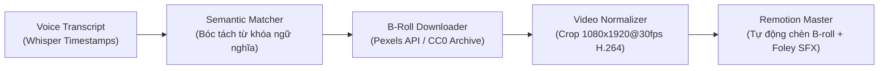

# 🎬 Automated B-Roll Downloader & Semantic Matcher

Hệ thống tự động tải và chèn video B-roll minh họa dọc (9:16) chuẩn điện ảnh theo từng câu nói của nhân vật.

---

### 1. Cơ chế hoạt động (Workflow)



1. **Bóc tách từ khóa (Keyword Extraction):** Nhận diện các từ vựng mang tính hình tượng cao (*xe đạp, bàn làm việc, đọc sách, doanh thu, áp lực, khách hàng*).
2. **Dịch thuật ngữ nghĩa:** Tự động chuyển query tiếng Việt sang bộ prompt tiếng Anh chuẩn cho kho stock quốc tế (ví dụ: *"xe đạp"* -> *"bicycle riding sunset aesthetic"*).
3. **Tải & Chuẩn hóa:** Tự động tải video dọc từ Pexels API và render thành định dạng tương thích 100% với Remotion (`1080x1920`, `30fps`, `H.264 yuv420p`, tắt audio gốc).
4. **Smart Fallback:** Nếu người dùng chưa cấu hình `PEXELS_API_KEY`, script tự động kích hoạt bộ sinh B-roll điện ảnh cục bộ (với chuyển động Ken Burns zoom mượt mà) để video không bao giờ bị lỗi.

---

### 2. Cách thiết lập Pexels API (Miễn phí)

1. Đăng ký tài khoản miễn phí tại [Pexels Developer](https://www.pexels.com/api/).
2. Nhận API Key (hạn mức miễn phí 200 requests/giờ).
3. Thêm vào file `.env` ở thư mục gốc dự án:
   ```env
   PEXELS_API_KEY=your_actual_pexels_api_key_here
   ```

---

### 3. Hướng dẫn sử dụng bằng lệnh (CLI)

#### Tải thủ công một clip B-roll:
```bash
python tools/broll_downloader.py --query "xe đạp" --duration 3.0
python tools/broll_downloader.py --query "laptop workspace" --duration 2.5
```

#### Tự động phân tích transcript và lên lịch B-roll:
```bash
python tools/semantic_broll_matcher.py
```
Output lịch B-roll được ghi tự động vào `media/semantic_broll_schedule.json` và sẵn sàng nạp thẳng vào composition Remotion.
